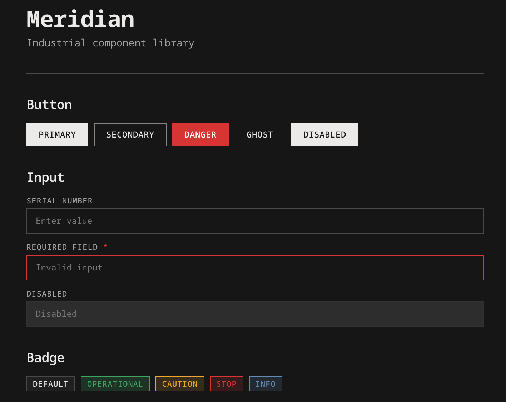

<p align="center">
  
</p>

<h1 align="center">meridian</h1>

<p align="center">
  <strong>contemporary industrial style component library</strong>
</p>

<p align="center">
  <a href="https://github.com/bxrne/meridian/actions/workflows/ci.yml">
    
  </a>
  <a href="https://github.com/bxrne/meridian/blob/main/LICENSE">
    
  </a>
  <a href="https://github.com/bxrne/meridian">
    
  </a>
  <a href="https://github.com/bxrne/meridian">
    
  </a>
</p>

<p align="center">
  <a href="https://bxrne.github.io/meridian">documentation</a> ·
  <a href="https://github.com/bxrne/meridian/issues/new?template=bug_report.yml">report bug</a> ·
  <a href="https://github.com/bxrne/meridian/issues/new?template=feature_request.yml">request feature</a>
</p>

---

## overview

meridian is a react component library with an industrial manufacturing aesthetic. inspired by factory floors, safety markings, and technical documentation.

### features

- **industrial aesthetic** — sharp edges, monospace typography, safety-signal colors
- **zero runtime** — pure CSS styling via data attributes, no JS overhead
- **dark mode** — automatic dark mode with `prefers-color-scheme`
- **typescript first** — full type definitions with JSDoc documentation
- **accessible** — proper focus states and ARIA support

### components

```
button · badge · card · checkbox · heading
input · label · separator · switch · text
```

## installation

```bash
# bun
bun add github:bxrne/meridian

# npm
npm install github:bxrne/meridian

# pnpm
pnpm add github:bxrne/meridian
```

pin to a specific version:

```bash
bun add github:bxrne/meridian#v0.1.0
```

## usage

```tsx
import 'meridian/styles.css';
import { Button, Badge, Card, CardHeader, CardTitle, CardContent } from 'meridian';

function App() {
  return (
    <Card>
      <CardHeader>
        <CardTitle>system status</CardTitle>
      </CardHeader>
      <CardContent>
        <Badge variant="success">operational</Badge>
        <Button intent="primary">view details</Button>
      </CardContent>
    </Card>
  );
}
```

## theming

override CSS custom properties to customize:

```css
:root {
  --color-accent: hsl(25, 95%, 50%);  /* dark orange */
  --font-sans: 'IBM Plex Mono', monospace;
}
```

## development

```bash
# install dependencies
bun install

# start demo
bun run dev

# run tests
bun test

# lint
bun run lint

# build
bun run build
```

## contributing

see [CONTRIBUTING.md](./CONTRIBUTING.md) for guidelines.

## license

[MIT](./LICENSE) © [bxrne](https://github.com/bxrne)
